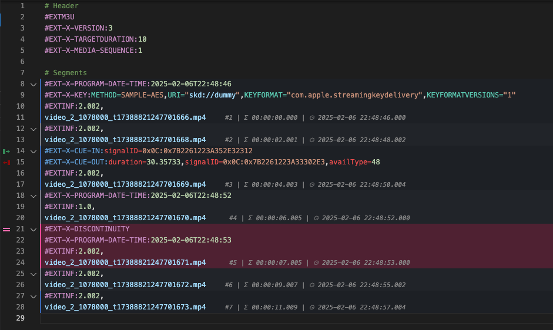

# M3U8 / HLS Language Support

Visual Studio Code extension providing language support for M3U8 (HLS) files.

## Features

- Syntax highlighting for:
  - HLS tags
  - URIs and URLs
  - Attributes and their values
  - Numbers and durations
  - ISO8601 dates
  - Comments
  - Invalid attributes (as per the HLS specification)

- Configurable decorations:
  - Folding support for segments and associated tags
  - Colour banding of segments for easier reading
    - Including specific colors for segments with chosen tags
  - Segment number decoration on each line

- Documentation for HLS tags on hover, and links to the relevant sections of the HLS specification 

## Supported File Extensions

- `.m3u8`
- `.m3u`

## Extension Settings

This extension contributes the following settings:

* `m3u8.features.colorBanding`: Enable/disable alternating color backgrounds to distinguish between consecutive segments
* `m3u8.features.segmentNumbering`: Enable/disable showing segment numbers after the URI
* `m3u8.features.folding`: Enable/disable code folding for segments (requires VS Code window reload)
* `m3u8.features.tagColors`: List of tag colors in format 'TAG,borderColor,backgroundColor'
* `m3u8.features.defaultColors`: Default colors for alternating segments when no tag-specific colors match

## Examples

The extension includes example files in the `examples` directory demonstrating various HLS playlist features:

- Basic Media Playlist
- Multivariant Playlist
- Encrypted Media
- Discontinuities
- Alternative Renditions
- And more...

## Contributing

Found a bug or have a feature request? Please open an issue on [GitHub](https://github.com/wabiloo/vscode-m3u8-language).

## License

This extension is licensed under the [MIT License](LICENSE).
